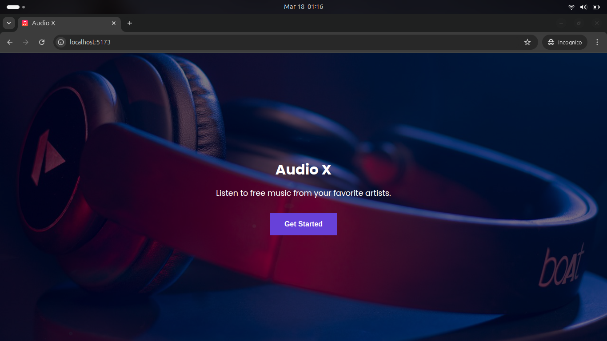
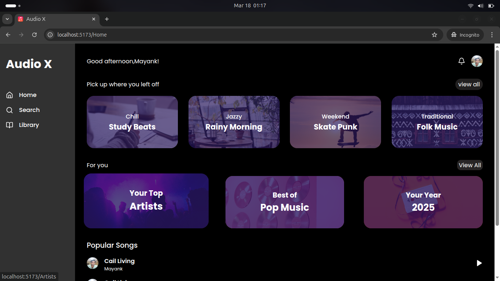

# React Music Site

 


 


A React-based music streaming site that allows users to browse and play songs from various artists. This project is built using modern web technologies to provide a seamless and responsive user experience.

## Features

- **Browse Songs**: Explore a wide range of songs from various artists.
- **Search Functionality**: Search for specific songs, artists, or albums.
- **Play Music**: Play songs directly in the browser with a built-in music player.
- **Responsive Design**: Fully responsive design for optimal viewing on desktop, tablet, and mobile devices.
- **Artist Pages**: Dedicated pages for each artist with their discography and popular tracks.
- **Favorites**: Add songs to your favorites list for quick access.

## Technologies Used

- **React**: A JavaScript library for building user interfaces.
- **React Router**: For handling navigation and routing within the app.
- **Redux**: For state management across the application.
- **Axios**: For making HTTP requests to fetch song data.
- **SASS/SCSS**: For styling the application.
- **Howler.js**: A JavaScript library for audio manipulation and playback.

## Installation

To run this project locally, follow these steps:

1. **Clone the repository**:
   ```bash
   git clone https://github.com/your-username/react-music-site.git

   
   cd react-music-site

   npm install

   npm run dev